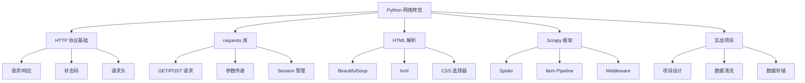

# Python 网络爬虫 - 学习计划

> 📅 创建日期：2026-03-11
> 🎯 预计完成： TBD

---

## 📚 知识体系

---

## 📋 学习知识点清单

### 1. HTTP 协议基础
- [ ] HTTP 请求/响应模型
- [ ] 常见状态码含义
- [ ] 请求头/响应头结构
- [ ] Cookie 和 Session 机制

### 2. requests 库使用
- [ ] GET/POST 请求
- [ ] 参数传递（params/data/json）
- [ ] 请求头定制
- [ ] Session 会话管理
- [ ] 文件上传下载

### 3. BeautifulSoup 解析
- [ ] HTML 文档结构
- [ ] 标签查找（find/find_all）
- [ ] CSS 选择器
- [ ] 属性获取
- [ ] 文本提取

### 4. Scrapy 框架
- [ ] Scrapy 架构
- [ ] Spider 编写
- [ ] Item 定义
- [ ] Pipeline 数据处理
- [ ] Middleware 中间件

### 5. 实战项目
- [ ] 项目需求分析
- [ ] 爬虫设计
- [ ] 数据清洗
- [ ] 数据存储（SQLite/CSV）
- [ ] 异常处理

---

## 📊 进度跟踪

| 日期 | 学习内容 | 完成知识点 | 备注 |
|------|----------|------------|------|
| - | - | - | - |

---

## 🎯 里程碑

- [ ] 25% - 完成 HTTP 协议和 requests 基础
- [ ] 50% - 完成 HTML 解析技术
- [ ] 75% - 完成 Scrapy 框架学习
- [ ] 100% - 完成实战项目

---

*本计划由 AI 助手小小生成*
