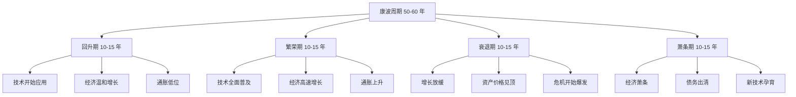
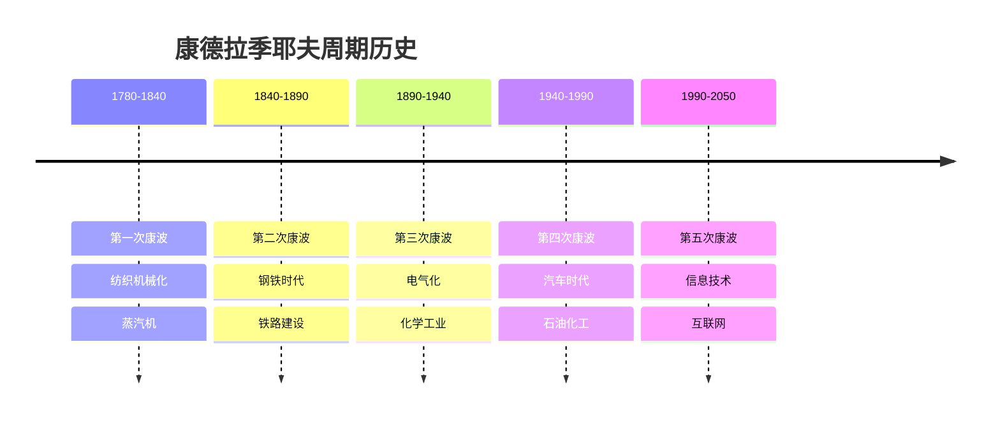
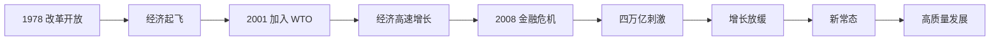
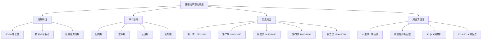

# 康德拉季耶夫周期理论 - 学习笔记

> 最后更新：2026-03-11
> 📚 来源：《涛动周期论》《涛动周期录》- 周金涛

---

## 📚 知识点总览

- 康德拉季耶夫周期的定义与特征
- 康波的四个阶段划分
- 技术创新与康波的关系
- 价格波动与康波周期
- 康波的世界经济意义

---

## 一、康德拉季耶夫周期基础

### 1.1 什么是康德拉季耶夫周期

**核心概念**：
- 康德拉季耶夫周期（Kondratiev Wave），简称**康波**，是苏联经济学家尼古拉·康德拉季耶夫于 1925 年提出的经济周期理论
- 周期长度约为**50-60 年**，是资本主义经济中最长的周期波动
- 康波的本质是**技术革命驱动**的经济长周期

**关键要点**：
- 一个康波周期包含**四个阶段**：回升、繁荣、衰退、萧条
- 康波的驱动力是**根本性技术创新**（如蒸汽机、电力、信息技术）
- 康波是**世界经济**的周期，不是单一国家的周期
- 康波具有**不可逆性**，个人无法改变但可以利用

**周金涛的核心观点**：
> "人生就是一次康德拉季耶夫周期"
> 
> "财富积累的根本来源是周期，而不是个人能力"

---

### 1.2 康波的四个阶段

**各阶段特征**：

| 阶段 | 经济增长 | 通胀水平 | 资产表现 | 典型特征 |
|------|----------|----------|----------|----------|
| **回升** | 温和复苏 | 低位稳定 | 股票向好 | 新技术开始应用 |
| **繁荣** | 高速增长 | 持续上升 | 商品向好 | 技术全面普及 |
| **衰退** | 增长放缓 | 高位波动 | 现金为王 | 危机频繁爆发 |
| **萧条** | 负增长 | 通缩压力 | 债券向好 | 债务出清完成 |

---

### 1.3 康波的历史划分

**历次康波周期**：

**第五次康波（当前）**：
- **起点**：1990 年左右（信息技术革命开始）
- **繁荣期**：1990-2004 年（互联网泡沫前）
- **衰退起点**：2004-2008 年（增长放缓）
- **衰退期**：2008-2025 年（金融危机后）
- **萧条期**：预计 2025-2035 年
- **回升期**：预计 2035 年后（新技术革命）

---

## 二、周金涛的康波理论

### 2.1 人生财富定位

**核心概念**：
- 人的一生大约有**60 年**的工作和生活时间
- 这恰好对应一个完整的康德拉季耶夫周期
- 因此，**人生就是一次康波**

**关键要点**：
- 人一生的财富积累主要取决于**是否抓住了周期机遇**
- 在康波的**回升期和繁荣期**，个人努力更容易获得回报
- 在康波的**衰退期和萧条期**，个人努力的效果大打折扣
- **40 岁左右**是人生的关键转折点，对应康波的转折点

**周金涛经典论述**：
> "1985 年之后出生的人，人生第一次机遇只能在 2019 年前后出现"
> 
> "2018-2019 年是万劫不复之年，也是机遇之年"
> 
> "财富积累是周期的函数，不是个人能力的函数"

---

### 2.2 康波与中国经济

**中国经济的康波定位**：

**周金涛的判断**：
- 中国经济的高速增长期（2001-2010）对应康波繁荣期
- 2010 年后进入增长放缓，对应康波衰退期
- 2018-2019 年是重要转折点
- 未来需要寻找新的增长点（技术创新）

---

## 三、实践案例

### 3.1 康波周期中的投资机会

**不同阶段的投资策略**：

| 康波阶段 | 推荐资产 | 避免资产 | 策略 |
|----------|----------|----------|------|
| **回升期** | 股票、成长股 | 现金、债券 | 积极投资 |
| **繁荣期** | 商品、房地产 | 现金 | 持有实物资产 |
| **衰退期** | 现金、黄金 | 股票、房地产 | 防守为主 |
| **萧条期** | 债券、现金 | 股票、商品 | 等待机会 |

**周金涛的实战建议**：
- 2015-2016 年：商品市场有机会（繁荣期末尾）
- 2018-2019 年：现金为王，等待机会（衰退期）
- 2020 年后：关注新技术革命带来的机会

---

## 💡 学习心得

1. **周期思维的重要性**：康波理论提供了一个宏观的分析框架，帮助我们理解经济运行的长期规律

2. **个人与周期的关系**：个人财富积累确实与周期密切相关，但不应完全否定个人努力的价值

3. **周期定位的意义**：了解当前所处的周期阶段，有助于做出更理性的投资和职业决策

4. **理论的局限性**：康波周期长度并非精确的 50-60 年，实际经济运行更加复杂

---

## ⚠️ 易错点提醒

- ❌ **误区 1**：康波周期是精确的时间表
  - ✅ 正确理解：康波是趋势性框架，具体时间点会有偏差

- ❌ **误区 2**：周期决定一切，个人努力无用
  - ✅ 正确理解：周期提供机遇，但把握机遇需要能力

- ❌ **误区 3**：康波可以准确预测短期市场
  - ✅ 正确理解：康波是长期框架，不适合短期交易

- ❌ **误区 4**：所有国家都遵循同一康波节奏
  - ✅ 正确理解：康波是世界经济周期，各国节奏有差异

---

## 📊 知识图谱

---

## 🔗 相关资源

- **书籍**：
  - 《涛动周期论》- 周金涛
  - 《涛动周期录》- 周金涛
  - 《长波理论》- 各种经济学著作

- **文章**：
  - 周金涛演讲实录
  - 康德拉季耶夫原始论文

- **相关知识点**：
  - [[02-房地产周期]]
  - [[03-库存周期]]
  - [[04-人生财富定位]]

---

## ✅ 掌握情况

- [x] 基本概念理解
- [x] 康波四阶段特征
- [x] 历史康波划分
- [ ] 周金涛理论深入理解
- [ ] 实际应用分析能力

---

*本笔记由 AI 助手小小整理生成*
