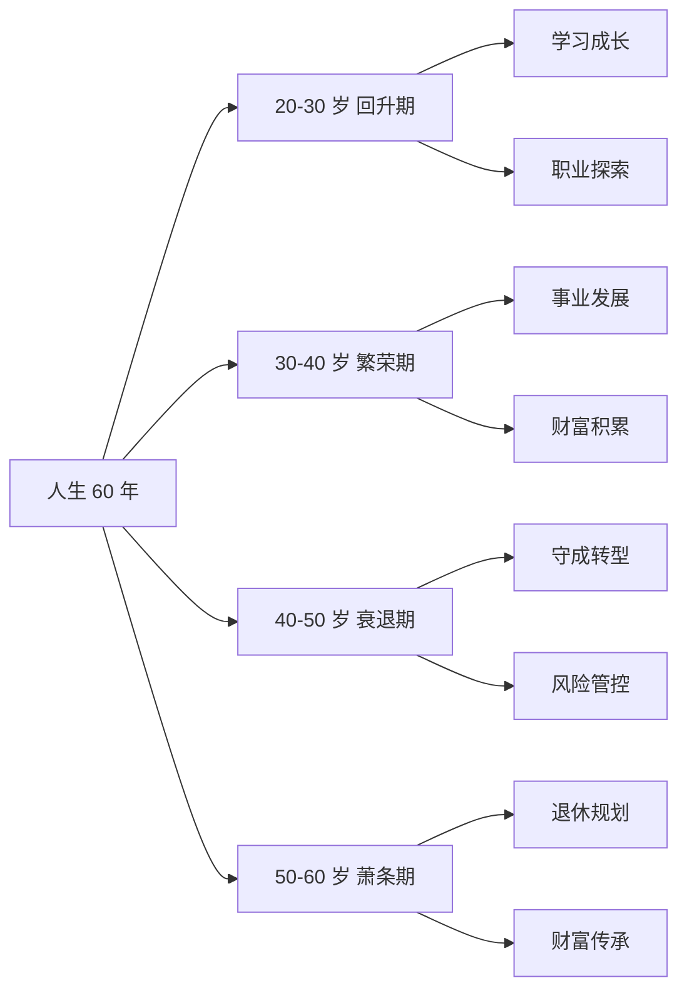
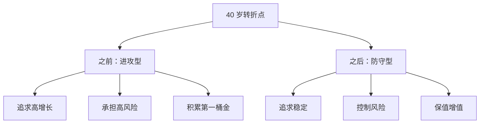
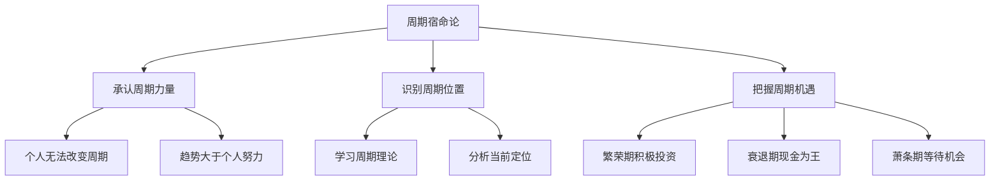
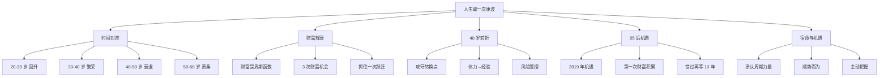

# 人生即一次康波 - 学习笔记

> 最后更新：2026-03-11
> 📚 来源：《涛动周期论》《涛动周期录》- 周金涛

---

## 📚 知识点总览

- 人生与康波的时间对应关系
- 财富积累的周期规律
- 40 岁关键转折点
- 85 后的人生机遇
- 周期定位与人生规划

---

## 一、人生与康波的对应关系

### 1.1 时间维度的对应

**核心概念**：
- 人的职业生涯大约从**22 岁**开始，到**60 岁**退休，约**38-40 年**
- 加上学习和成长期，人的一生有效经济活动时间约**50-60 年**
- 这恰好与一个**康德拉季耶夫周期（50-60 年）** 相对应

**关键要点**：
- 20-30 岁：对应康波的**回升期**（学习成长、初步探索）
- 30-40 岁：对应康波的**繁荣期**（事业发展、财富积累）
- 40-50 岁：对应康波的**衰退期**（守成、转型）
- 50-60 岁：对应康波的**萧条期**（退休规划、财富传承）

---

### 1.2 财富积累的周期规律

**核心概念**：
- 周金涛认为：**财富积累是周期的函数，不是个人能力的函数**
- 在康波的**繁荣期**，个人努力更容易获得超额回报
- 在康波的**萧条期**，即使再努力也难以获得好的回报

**关键要点**：
- **第一次财富积累机会**：通常在 30 岁左右（康波繁荣期）
- **第二次财富积累机会**：通常在 40 岁左右（康波转折点）
- **第三次财富积累机会**：通常在 50 岁左右（康波回升期）

**周金涛经典论述**：
> "一个人的一生中，真正能改变财富阶层的机会只有 3 次"
> 
> "这 3 次机会分别对应康波的三个关键转折点"
> 
> "抓住一次就能实现财富跃迁，抓住两次就能实现阶层跨越"

---

## 二、40 岁关键转折点

### 2.1 为什么是 40 岁？

**核心概念**：
- 40 岁是人生和康波的**双重转折点**
- 从生理角度：40 岁后体力开始下降，经验开始发挥作用
- 从周期角度：40 岁左右通常对应康波的**衰退 - 萧条转折点**

**关键要点**：
- 40 岁前的财富积累主要靠**体力 + 机遇**
- 40 岁后的财富积累主要靠**经验 + 资源**
- 40 岁是**攻守转换**的关键节点

---

### 2.2 85 后的人生机遇

**周金涛对 85 后的判断**：

| 出生年份 | 2019 年年龄 | 人生阶段 | 机遇定位 |
|----------|-------------|----------|----------|
| 1985 | 34 岁 | 事业上升期 | 第一次机遇 |
| 1988 | 31 岁 | 事业起步期 | 第一次机遇 |
| 1990 | 29 岁 | 职业探索期 | 第一次机遇 |
| 1995 | 24 岁 | 初入职场 | 准备期 |

**核心观点**：
> "1985 年之后出生的人，人生第一次机遇只能在 2019 年前后出现"
> 
> "2018-2019 年是万劫不复之年，也是机遇之年"
> 
> "85 后要在 2019 年抓住第一次财富机遇，否则要再等 10 年"

**2019 年的机遇**：
- 股票市场：A 股在 2018 年大跌后，2019 年有反弹机会
- 房地产市场：分化加剧，核心城市仍有价值
- 创业机会：新技术（AI、5G）开始应用

---

## 三、宿命与机遇

### 3.1 周期的宿命论

**核心概念**：
- 周金涛的理论带有**宿命论**色彩
- 他认为个人在周期面前是**渺小**的
- 但宿命不等于**消极**，而是要**顺势而为**

**关键要点**：
- **承认周期的力量**：不要与趋势对抗
- **识别周期的位置**：知道现在在哪里
- **把握周期的机遇**：在正确的时间做正确的事

---

### 3.2 如何把握周期机遇

**实践建议**：

**1. 学习周期理论**
- 了解康波的基本原理
- 掌握周期分析方法
- 关注权威研究（如周金涛的报告）

**2. 确定周期位置**
- 分析当前经济增长率
- 观察通胀水平
- 关注资产价格表现

**3. 制定应对策略**
- 繁荣期：积极投资，承担适度风险
- 衰退期：收缩战线，保证现金流
- 萧条期：保持耐心，等待机会

**4. 把握关键节点**
- 30 岁左右：积累第一桶金
- 40 岁左右：攻守转换
- 50 岁左右：财富传承

---

## 💡 学习心得

1. **周期思维的启发**：周金涛的理论提供了一个全新的视角来看待财富积累，让人意识到个人努力之外的宏观因素

2. **宿命与主动的平衡**：虽然周期有宿命色彩，但我们仍然可以主动学习和把握，不是完全消极等待

3. **时间窗口的重要性**：人生确实有关键的时间窗口，错过可能需要再等一个周期

4. **理论的适用性**：周金涛的理论更适合**投资决策**和**人生规划**，不太适合日常琐事

5. **批判性思考**：周期理论有其价值，但不应完全迷信，需要结合实际情况灵活运用

---

## ⚠️ 易错点提醒

- ❌ **误区 1**：完全相信宿命论，放弃个人努力
  - ✅ 正确理解：周期提供框架，努力决定上限

- ❌ **误区 2**：机械套用年龄与周期的对应
  - ✅ 正确理解：年龄对应是大概趋势，个体差异很大

- ❌ **误区 3**：把 2019 年当作唯一机遇
  - ✅ 正确理解：2019 是重要节点，但不是唯一机会

- ❌ **误区 4**：忽视个人能力和资源的作用
  - ✅ 正确理解：周期机遇需要能力来把握

- ❌ **误区 5**：用周期理论预测短期市场
  - ✅ 正确理解：康波是长期框架，不适合短期交易

---

## 📊 知识图谱

---

## 🔗 相关资源

- **书籍**：
  - 《涛动周期论》- 周金涛
  - 《涛动周期录》- 周金涛

- **演讲**：
  - 周金涛 2016 年演讲《人生就是一场康德拉季耶夫周期》
  - 周金涛 2015 年演讲《宿命与反抗》

- **相关知识点**：
  - [[01-康德拉季耶夫周期理论]]
  - [[03-房地产周期]]
  - [[05-宿命与机遇]]

---

## ✅ 掌握情况

- [x] 人生与康波的时间对应
- [x] 财富积累的周期规律
- [x] 40 岁关键转折点
- [x] 85 后的人生机遇
- [ ] 实际应用分析能力
- [ ] 个人周期定位

---

*本笔记由 AI 助手小小整理生成*
