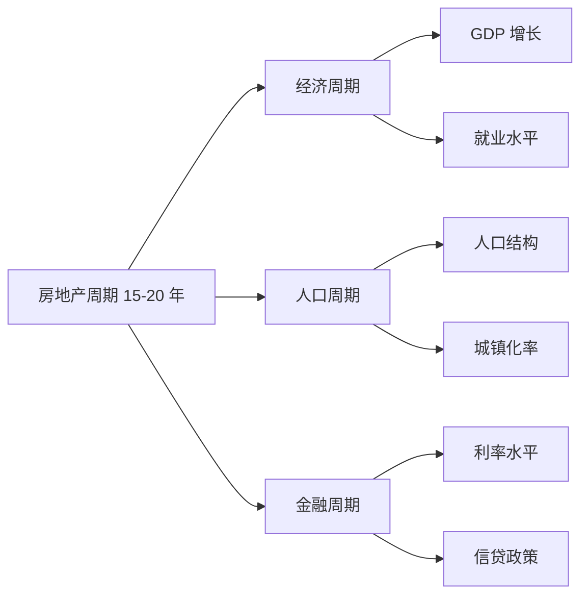
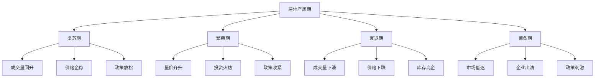
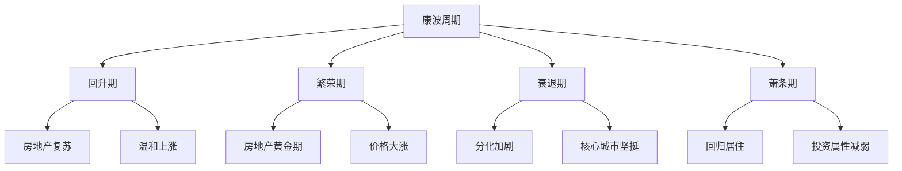
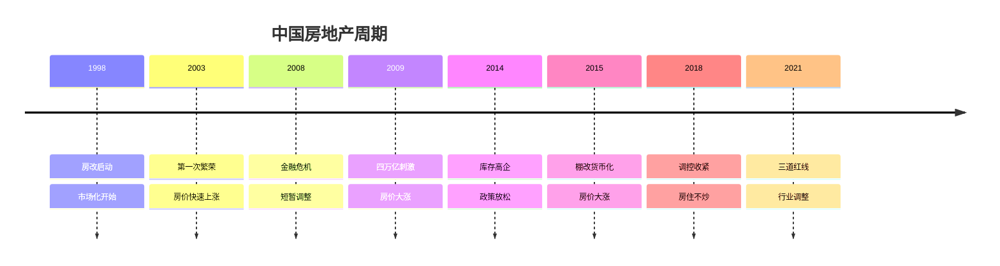
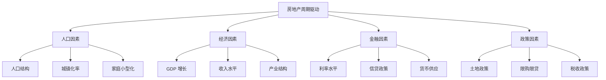
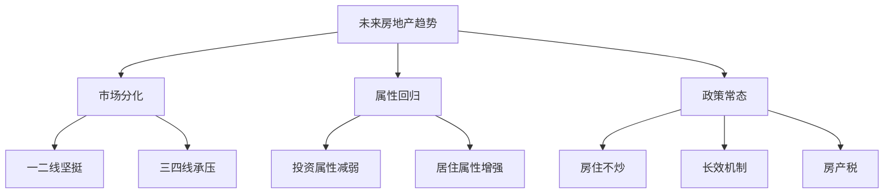
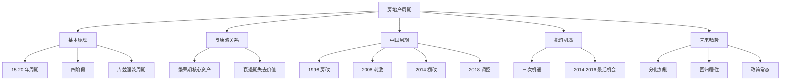

# 房地产周期 - 学习笔记

> 最后更新：2026-03-11
> 📚 来源：《涛动周期论》《涛动周期录》- 周金涛

---

## 📚 知识点总览

- 房地产周期的基本原理
- 房地产周期与康波的关系
- 中国房地产周期分析
- 房地产投资的时代机遇
- 未来房地产趋势判断

---

## 一、房地产周期基础

### 1.1 什么是房地产周期

**核心概念**：
- 房地产周期是指房地产市场的**周期性波动**
- 典型周期长度为**15-20 年**
- 房地产周期受**经济周期、人口周期、金融周期**多重影响

**关键要点**：
- 房地产周期通常**滞后于经济周期**
- 房地产是**康波繁荣期**的标志性资产
- 房地产周期的顶点通常对应康波繁荣期的结束

**库兹涅茨周期**：
- 美国经济学家西蒙·库兹涅茨提出
- 周期长度约**15-25 年**
- 主要与**建筑和房地产**投资相关
- 也被称为"建筑周期"

---

### 1.2 房地产周期的四个阶段

**各阶段特征**：

| 阶段 | 成交量 | 价格 | 库存 | 政策 | 投资策略 |
|------|--------|------|------|------|----------|
| **复苏** | 回升 | 企稳 | 高 | 放松 | 买入 |
| **繁荣** | 高位 | 上涨 | 低 | 收紧 | 持有 |
| **衰退** | 下滑 | 下跌 | 增加 | 观望 | 卖出 |
| **萧条** | 低迷 | 低位 | 高企 | 刺激 | 等待 |

---

## 二、房地产与康波的关系

### 2.1 房地产在康波中的定位

**核心概念**：
- 房地产是**康波繁荣期**的核心资产
- 康波繁荣期通常伴随**房地产大牛市**
- 康波衰退期开始后，房地产逐渐失去投资价值

**关键要点**：
- 康波**回升期**：房地产开始复苏
- 康波**繁荣期**：房地产黄金时代
- 康波**衰退期**：房地产分化加剧
- 康波**萧条期**：房地产回归居住属性

---

### 2.2 周金涛的房地产判断

**核心观点**：

> "房地产是康波繁荣期的产物，繁荣期结束后房地产将失去投资价值"
> 
> "2014-2016 年是中国房地产最后的机会"
> 
> "2018 年后房地产将进入分化时代"

**周金涛的预测**：

| 时间 | 判断 | 实际情况 |
|------|------|----------|
| 2014-2016 | 房地产最后机会 | ✅ 2015-2016 年大涨 |
| 2017 | 调控收紧 | ✅ 限购限贷升级 |
| 2018-2019 | 分化加剧 | ✅ 一二线与三四线分化 |
| 2020 后 | 回归居住 | ✅ 房住不炒成为国策 |

---

## 三、中国房地产周期分析

### 3.1 中国房地产周期历史

**中国房地产周期特点**：
- 周期长度约**5-7 年**（短于典型 15-20 年）
- 受**政策影响**较大
- **城镇化**是重要推动力
- **货币化**是重要支撑

---

### 3.2 房地产周期的驱动因素

**核心概念**：
- 房地产周期由**多重因素**共同驱动
- 不同阶段主导因素不同

**关键要点**：

**各因素权重变化**：
- **早期**（1998-2008）：城镇化 + 经济增长主导
- **中期**（2009-2016）：货币 + 信贷主导
- **后期**（2017-）：政策调控主导

---

## 四、房地产投资的时代机遇

### 4.1 房地产投资的三次机遇

**周金涛的观点**：

| 机遇 | 时间 | 特征 | 收益 |
|------|------|------|------|
| **第一次** | 1998-2003 | 房改启动 | 10 倍 + |
| **第二次** | 2008-2013 | 四万亿刺激 | 5-10 倍 |
| **第三次** | 2014-2016 | 棚改货币化 | 2-5 倍 |

**核心观点**：
> "2014-2016 年是普通人最后一次房地产致富机会"
> 
> "2018 年后房地产将失去普惠性投资价值"
> 
> "未来房地产投资将进入专业时代"

---

### 4.2 未来房地产趋势

**周金涛的判断**：

1. **分化加剧**
   - 一二线城市：仍有价值
   - 三四线城市：风险较大
   - 核心地段：保值功能

2. **回归居住**
   - 投资属性减弱
   - 居住属性增强
   - 租金回报率提升

3. **政策调控常态化**
   - 房住不炒成为国策
   - 长效机制建立
   - 房产税逐步推进

---

## 💡 学习心得

1. **房地产周期的宏观视角**：周金涛从康波角度分析房地产，提供了一个更宏观的视角

2. **时代机遇的稀缺性**：房地产致富的时代机遇确实稀缺，2014-2016 年可能是最后一次普惠性机会

3. **分化时代的到来**：未来房地产投资需要更专业的分析能力，不能简单买入持有

4. **政策的决定性作用**：中国房地产市场受政策影响极大，需要密切关注政策变化

5. **理性看待房地产**：房地产回归居住属性是长期趋势，投资需要降低预期

---

## ⚠️ 易错点提醒

- ❌ **误区 1**：房地产永远上涨
  - ✅ 正确理解：房地产有周期性，也会下跌

- ❌ **误区 2**：所有城市房地产都有投资价值
  - ✅ 正确理解：未来分化加剧，只有核心城市有价值

- ❌ **误区 3**：房地产政策不会变
  - ✅ 正确理解：政策会随经济周期调整

- ❌ **误区 4**：房地产可以短期炒作
  - ✅ 正确理解：房地产是长期投资，短期波动大

- ❌ **误区 5**：忽视持有成本
  - ✅ 正确理解：需要考虑资金成本、税费、维护等

---

## 📊 知识图谱

---

## 🔗 相关资源

- **书籍**：
  - 《涛动周期论》- 周金涛
  - 《涛动周期录》- 周金涛
  - 《房地产周期》- 任志强

- **报告**：
  - 周金涛房地产研究报告
  - 各大券商房地产研究报告

- **相关知识点**：
  - [[01-康德拉季耶夫周期理论]]
  - [[02-人生即一次康波]]
  - [[04-库存周期]]

---

## ✅ 掌握情况

- [x] 房地产周期基本原理
- [x] 房地产与康波的关系
- [x] 中国房地产周期历史
- [x] 房地产投资机遇
- [ ] 实际应用分析能力
- [ ] 城市分化判断能力

---

*本笔记由 AI 助手小小整理生成*
