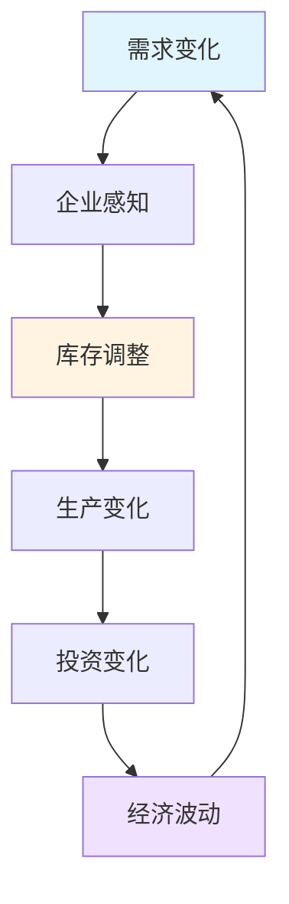
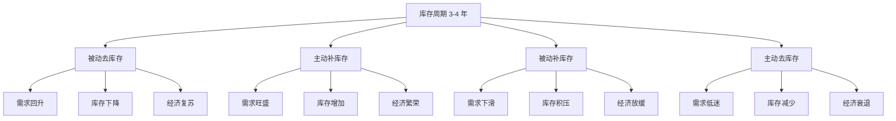
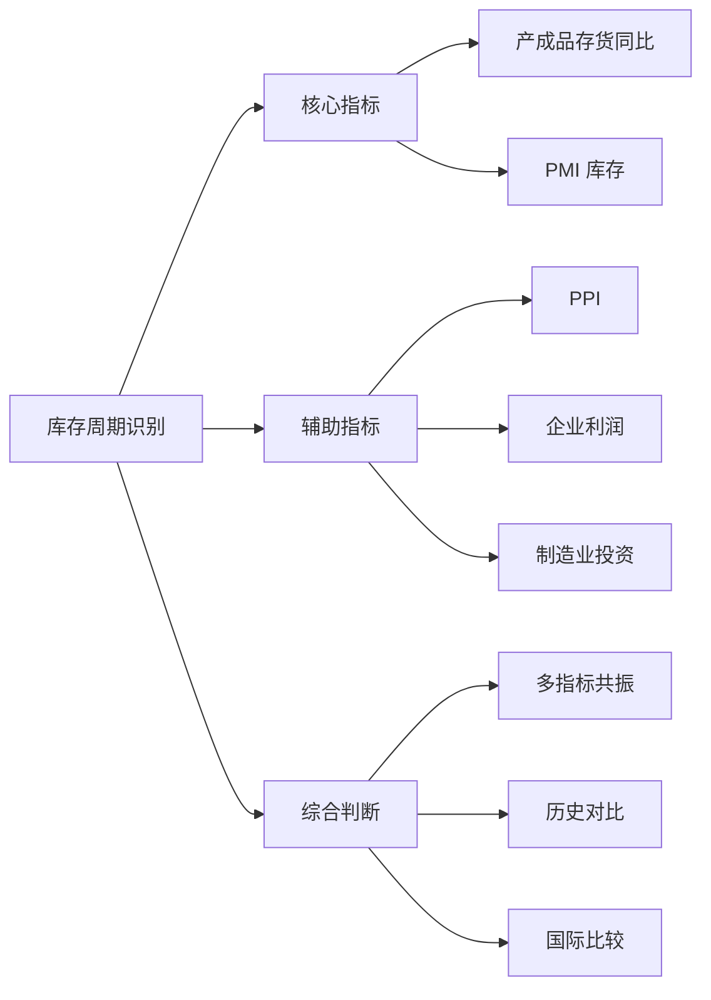
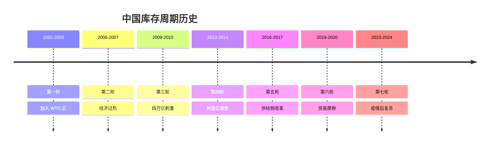
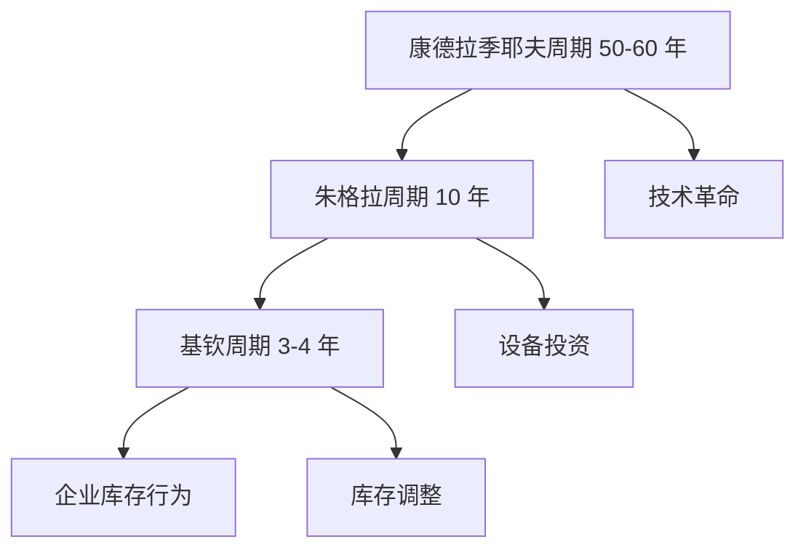
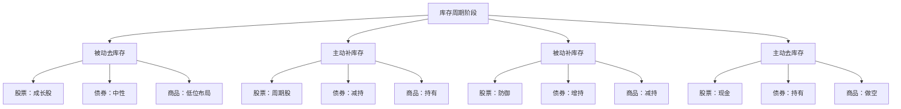
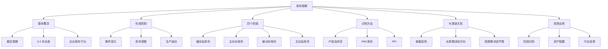

# 库存周期（基钦周期）- 学习笔记

> 最后更新：2026-03-11
> 📚 来源：《涛动周期论》《涛动周期录》- 周金涛

---

## 📚 知识点总览

- 库存周期的定义与特征
- 库存周期的形成机制
- 库存周期的四个阶段
- 库存周期与经济波动
- 库存周期的投资应用

---

## 一、库存周期基础

### 1.1 什么是库存周期

**核心概念**：
- 库存周期（Inventory Cycle），又称**基钦周期**（Kitchin Cycle）
- 由英国经济学家约瑟夫·基钦于 1923 年提出
- 周期长度约为**3-4 年**（40 个月左右）
- 是经济周期中**最短**的周期

**关键要点**：
- 库存周期的本质是**企业库存行为**的周期性波动
- 企业根据需求预期调整库存，导致生产和投资的波动
- 库存周期是**需求驱动**的短周期
- 库存周期嵌套在更长的朱格拉周期（设备投资周期）和康德拉季耶夫周期中

**周金涛的观点**：
> "库存周期是经济波动的放大器"
> 
> "短周期波动主要由库存行为驱动"
> 
> "把握库存周期可以进行短期资产配置"

---

### 1.2 库存周期的形成机制

**形成过程**：

1. **需求上升** → 企业销售增加
2. **库存下降** → 企业感知到库存不足
3. **增加生产** → 企业扩大生产补充库存
4. **投资增加** → 企业增加原材料和设备采购
5. **经济扩张** → 整体经济向好
6. **需求见顶** → 库存积累过多
7. **减少生产** → 企业去库存
8. **投资减少** → 经济收缩

**关键要点**：
- 库存调整存在**时滞**，导致周期波动
- 企业预期往往**过度反应**，放大波动
- 库存周期是**内生性**周期，由经济系统内部产生

---

### 1.3 库存周期的四个阶段

**各阶段特征**：

| 阶段 | 需求 | 库存 | 生产 | 价格 | 经济表现 |
|------|------|------|------|------|----------|
| **被动去库存** | 回升 | 下降 | 企稳 | 低位 | 复苏初期 |
| **主动补库存** | 旺盛 | 增加 | 扩张 | 上涨 | 繁荣期 |
| **被动补库存** | 下滑 | 积压 | 放缓 | 高位 | 放缓期 |
| **主动去库存** | 低迷 | 减少 | 收缩 | 下跌 | 衰退期 |

---

## 二、库存周期的识别

### 2.1 库存周期的指标

**核心指标**：

| 指标 | 含义 | 来源 |
|------|------|------|
| **工业企业产成品存货** | 企业库存水平 | 国家统计局 |
| **工业企业产成品存货同比** | 库存增速 | 国家统计局 |
| **PMI 产成品库存** | 采购经理库存预期 | 统计局 PMI 调查 |
| **美国库存销售比** | 库存相对销售水平 | 美国商务部 |

**辅助指标**：
- PPI（工业生产者出厂价格指数）
- 工业企业利润
- 制造业投资
- 进口数据

---

### 2.2 中国库存周期历史

**历次库存周期**：

**周金涛的分析**：

| 周期 | 时间 | 背景 | 特征 |
|------|------|------|------|
| 第一轮 | 2002-2003 | 加入 WTO | 出口驱动 |
| 第二轮 | 2006-2007 | 经济过热 | 投资过热 |
| 第三轮 | 2009-2010 | 四万亿 | 政策刺激 |
| 第四轮 | 2013-2014 | 刺激后 | 产能过剩 |
| 第五轮 | 2016-2017 | 供给侧 | 价格上涨 |
| 第六轮 | 2019-2020 | 贸易摩擦 | 外需波动 |

---

## 三、库存周期与康波

### 3.1 嵌套周期理论

**核心概念**：
- 经济周期是**嵌套结构**
- 康波（50-60 年）包含多个朱格拉周期（10 年）
- 朱格拉周期包含多个基钦周期（3-4 年）

**周金涛的观点**：
> "长周期决定方向，短周期决定节奏"
> 
> "在康波衰退期，库存周期波动加剧"
> 
> "短周期反弹不改变长周期趋势"

---

### 3.2 康波不同阶段的库存周期特征

| 康波阶段 | 库存周期特征 | 波动幅度 | 持续时间 |
|----------|--------------|----------|----------|
| **回升期** | 温和波动 | 较小 | 稳定 |
| **繁荣期** | 扩张明显 | 中等 | 偏长 |
| **衰退期** | 剧烈波动 | 较大 | 不稳定 |
| **萧条期** | 持续去库存 | 大 | 偏短 |

**实践意义**：
- 康波繁荣期：库存周期投资机会更明确
- 康波衰退期：库存周期波动大，风险高
- 康波萧条期：库存周期失效，需等待新周期

---

## 四、库存周期的投资应用

### 4.1 不同阶段的资产配置

**各阶段投资策略**：

| 阶段 | 股票 | 债券 | 商品 | 现金 |
|------|------|------|------|------|
| **被动去库存** | 成长股 | 中性 | 布局 | 低配 |
| **主动补库存** | 周期股 | 减持 | 持有 | 低配 |
| **被动补库存** | 防御 | 增持 | 减持 | 中配 |
| **主动去库存** | 现金 | 持有 | 做空 | 高配 |

---

### 4.2 周金涛的库存周期判断

**2016-2017 年库存周期**：

> "2016 年开启的库存周期是供给侧改革驱动的"
> 
> "价格上涨是主要特征"
> 
> "2017 年四季度是库存周期高点"

**实际验证**：
- ✅ 2016 年 PPI 由负转正
- ✅ 2017 年周期股大涨
- ✅ 2017 年四季度后经济放缓

**2019-2020 年库存周期**：

> "2019 年库存周期底部可能出现"
> 
> "贸易摩擦延长了去库存时间"
> 
> "2020 年疫情后有新周期机会"

---

## 💡 学习心得

1. **库存周期的实用性**：相比康波，库存周期更短、更实用，适合中短期投资决策

2. **指标的重要性**：库存周期需要依靠数据指标来识别，不能凭感觉

3. **嵌套周期的视角**：理解库存周期需要放在更大的周期框架中，避免只见树木不见森林

4. **中国特色的库存周期**：中国的库存周期受政策影响较大，需要结合政策分析

5. **投资的参考工具**：库存周期是投资决策的参考工具，不是预测神器

---

## ⚠️ 易错点提醒

- ❌ **误区 1**：库存周期是固定 3-4 年
  - ✅ 正确理解：周期长度有弹性，受多种因素影响

- ❌ **误区 2**：库存周期可以准确预测
  - ✅ 正确理解：库存周期是分析框架，不是预测工具

- ❌ **误区 3**：只看库存指标就够了
  - ✅ 正确理解：需要结合多指标综合判断

- ❌ **误区 4**：库存周期独立于长周期
  - ✅ 正确理解：库存周期嵌套在更长周期中

- ❌ **误区 5**：库存周期适合所有资产
  - ✅ 正确理解：库存周期主要影响周期性资产

---

## 📊 知识图谱

---

## 🔗 相关资源

- **书籍**：
  - 《涛动周期论》- 周金涛
  - 《涛动周期录》- 周金涛
  - 《经济周期理论研究》- 各种经济学著作

- **数据**：
  - 国家统计局：工业企业产成品存货
  - 统计局 PMI 调查：产成品库存指数
  - 美国商务部：库存销售比

- **相关知识点**：
  - [[01-康德拉季耶夫周期理论]]
  - [[03-房地产周期]]
  - [[06-周期定位实战]]

---

## ✅ 掌握情况

- [x] 库存周期基本概念
- [x] 库存周期形成机制
- [x] 四个阶段特征
- [x] 识别方法和指标
- [ ] 实际应用分析能力
- [ ] 资产配置实战

---

*本笔记由 AI 助手小小整理生成*
