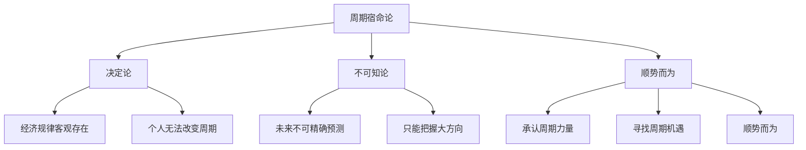
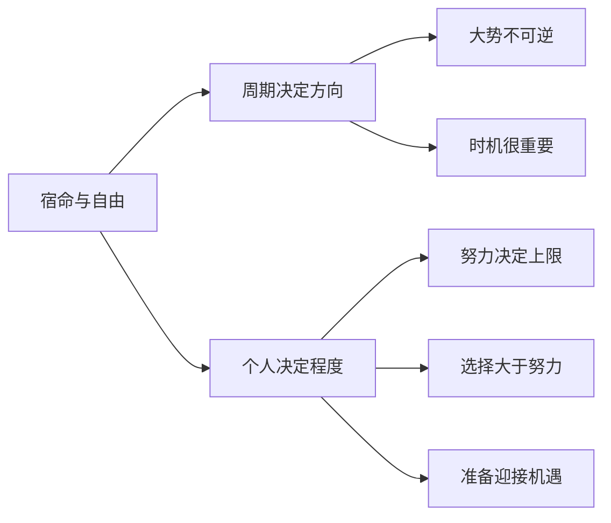
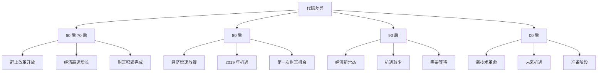
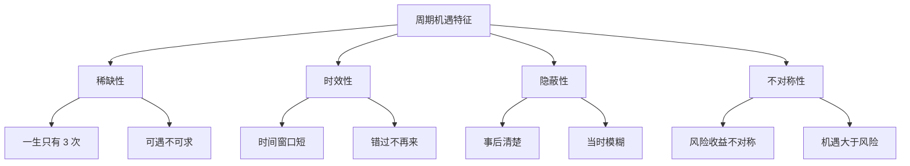
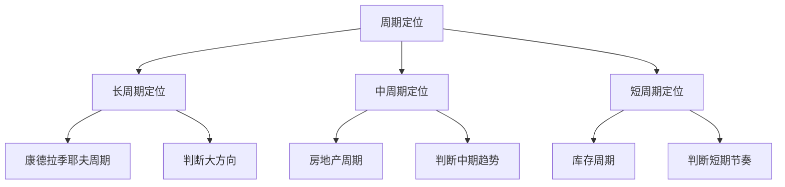
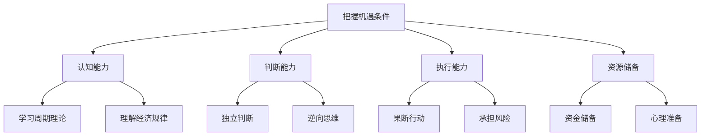
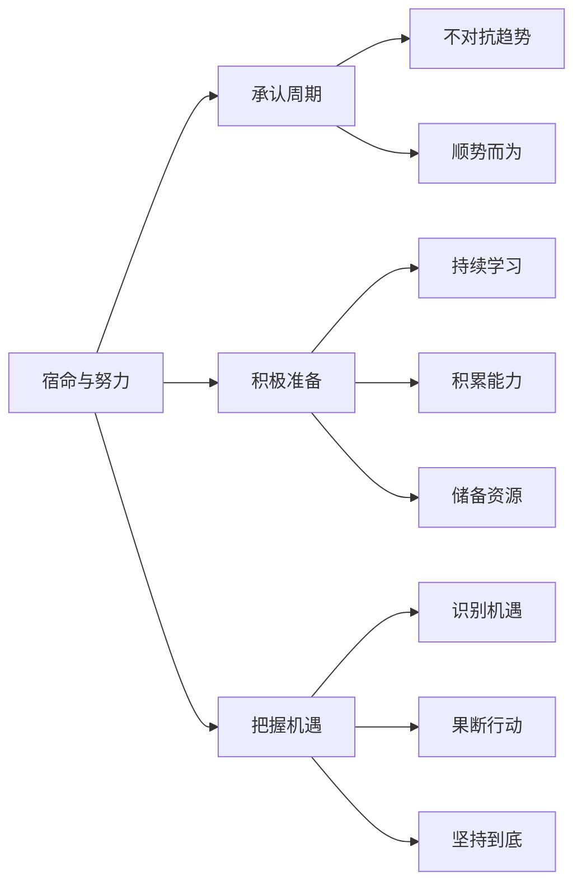
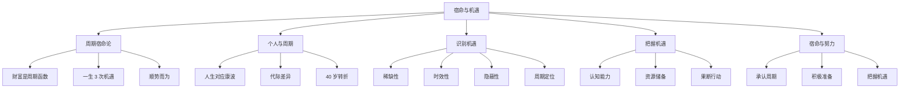

# 宿命与机遇 - 学习笔记

> 最后更新：2026-03-11
> 📚 来源：《涛动周期论》《涛动周期录》- 周金涛

---

## 📚 知识点总览

- 周期宿命论的哲学基础
- 个人与周期的关系
- 如何识别周期机遇
- 如何把握周期机遇
- 宿命与努力的平衡

---

## 一、周期宿命论

### 1.1 什么是周期宿命论

**核心概念**：
- 周金涛的周期理论带有**宿命论**色彩
- 认为个人在宏观经济周期面前是**渺小**的
- 个人的财富积累主要由**周期位置**决定，而非个人能力

**关键要点**：
- 宿命不等于**消极**，而是承认客观规律
- 宿命论的目的是让人**顺势而为**，而非对抗趋势
- 宿命论强调**时机**的重要性

**周金涛的经典论述**：
> "财富积累是周期的函数，不是个人能力的函数"
> 
> "一个人一生中能改变财富阶层的机会只有 3 次"
> 
> "在错误的时间，再努力也是徒劳"
> 
> "宿命不是让你放弃，而是让你知道什么时候该努力"

---

### 1.2 宿命论的哲学基础

**哲学内涵**：

| 层面 | 内容 | 意义 |
|------|------|------|
| **本体论** | 周期是客观存在的 | 承认规律 |
| **认识论** | 人可以认识周期 | 学习理论 |
| **方法论** | 人可以利用周期 | 把握机遇 |
| **价值论** | 顺势者昌，逆势者亡 | 指导行动 |

---

### 1.3 宿命与自由意志

**核心问题**：
- 如果一切都是宿命，个人努力还有意义吗？
- 如何在宿命论框架下理解自由意志？

**周金涛的回答**：

**平衡观点**：
- **周期决定方向**：大趋势个人无法改变
- **个人决定程度**：在趋势内可以做到什么程度取决于个人
- **时机很重要**：在正确的时间做正确的事
- **准备迎接机遇**：机遇来临时要有能力把握

---

## 二、个人与周期的关系

### 2.1 人生与周期的对应

**核心概念**：
- 人的一生约 60 年，对应一个康德拉季耶夫周期
- 人生的不同阶段对应周期的不同阶段
- 40 岁是人生和周期的双重转折点

**人生周期对应**：

| 年龄段 | 人生阶段 | 康波阶段 | 特征 |
|--------|----------|----------|------|
| 20-30 岁 | 学习探索 | 回升期 | 积累能力 |
| 30-40 岁 | 事业发展 | 繁荣期 | 财富积累 |
| 40-50 岁 | 守成转型 | 衰退期 | 风险管控 |
| 50-60 岁 | 退休传承 | 萧条期 | 财富保值 |

**周金涛的观点**：
> "30 岁之前靠能力，30 岁之后靠周期"
> 
> "40 岁是人生的分水岭"
> 
> "人生的财富积累主要在 30-40 岁这 10 年"

---

### 2.2 代际差异与周期

**不同代际的周期定位**：

**周金涛对各代际的判断**：

| 代际 | 出生年份 | 周期定位 | 机遇判断 |
|------|----------|----------|----------|
| 60 后 | 1960-1969 | 康波繁荣期 | 机遇最多 |
| 70 后 | 1970-1979 | 康波繁荣期 | 机遇较多 |
| 80 后 | 1980-1989 | 康波衰退期 | 2019 年机遇 |
| 90 后 | 1990-1999 | 康波衰退期 | 机遇较少 |
| 00 后 | 2000-2009 | 康波萧条期 | 等待新周期 |

---

## 三、识别周期机遇

### 3.1 周期机遇的特征

**核心概念**：
- 周期机遇具有**稀缺性**：一生中只有几次
- 周期机遇具有**时效性**：错过需要再等一个周期
- 周期机遇具有**隐蔽性**：当时可能看不清楚

**关键要点**：

**周金涛的判断标准**：
- 资产价格处于**历史低位**
- 市场情绪处于**极度悲观**
- 宏观经济处于**周期底部**
- 政策环境开始**转向宽松**

---

### 3.2 如何识别周期位置

**识别方法**：

| 方法 | 指标 | 判断依据 |
|------|------|----------|
| **经济增长** | GDP 增速 | 高于/低于潜在增速 |
| **通胀水平** | CPI、PPI | 通胀/通缩压力 |
| **资产价格** | 股票、房地产 | 估值水平 |
| **市场情绪** | 投资者信心 | 乐观/悲观程度 |
| **政策取向** | 货币、财政政策 | 宽松/紧缩 |

**周金涛的周期定位框架**：

---

## 四、把握周期机遇

### 4.1 把握机遇的条件

**核心概念**：
- 把握周期机遇需要**能力 + 勇气 + 资源**
- 机遇来临时，只有准备好的人才能抓住

**关键条件**：

**周金涛的建议**：
> "机遇来临时，要有足够的资金储备"
> 
> "大多数人输在不敢行动，而不是判断错误"
> 
> "逆向投资需要强大的心理素质"

---

### 4.2 把握机遇的策略

**实践策略**：

**1. 保持现金流**
- 在经济繁荣期积累现金
- 为衰退期的机遇做准备
- 现金是把握机遇的子弹

**2. 持续学习**
- 学习周期理论
- 提高识别能力
- 保持对市场的敏感

**3. 建立框架**
- 形成自己的分析框架
- 不盲从市场情绪
- 坚持独立思考

**4. 果断行动**
- 机遇来临时果断出手
- 不要追求完美时点
- 适度分散风险

**5. 长期持有**
- 周期机遇需要时间兑现
- 不要被短期波动干扰
- 坚持到周期转折

---

## 五、宿命与努力的平衡

### 5.1 正确的宿命论态度

**核心概念**：
- 宿命论不是消极等待，而是**积极准备**
- 承认周期的力量，但不放弃个人努力

**平衡观点**：

**周金涛的智慧**：
> "宿命让你知道什么是不能改变的"
> 
> "努力让你把握可以改变的部分"
> 
> "智慧在于区分两者"

---

### 5.2 实践建议

**日常行动**：

| 周期阶段 | 行动重点 | 具体做法 |
|----------|----------|----------|
| **回升期** | 学习积累 | 学习知识、提升能力 |
| **繁荣期** | 积极行动 | 投资、创业、扩张 |
| **衰退期** | 防守准备 | 积累现金、控制风险 |
| **萧条期** | 等待机遇 | 保持耐心、寻找机会 |

**心态调整**：
- 接受周期的起伏
- 不因一时得失而情绪波动
- 保持长期视角
- 相信周期的力量

---

## 💡 学习心得

1. **宿命论的积极意义**：周金涛的宿命论不是让人消极，而是让人更加理性地看待财富积累

2. **时机的重要性**：同样的努力，在不同的周期时点，结果可能天差地别

3. **准备的价值**：机遇只青睐有准备的人，平时积累很重要

4. **平衡的智慧**：在宿命和努力之间找到平衡，既不过度自信，也不消极等待

5. **长期视角**：周期理论帮助建立长期视角，避免被短期波动干扰

---

## ⚠️ 易错点提醒

- ❌ **误区 1**：宿命论就是什么都不做
  - ✅ 正确理解：宿命论是积极准备，等待机遇

- ❌ **误区 2**：周期可以精确预测
  - ✅ 正确理解：周期是框架，不是精确预测工具

- ❌ **误区 3**：只要等到机遇就能成功
  - ✅ 正确理解：机遇需要能力来把握

- ❌ **误区 4**：宿命论否定个人努力
  - ✅ 正确理解：宿命论强调努力要在正确的时点

- ❌ **误区 5**：周期理论适用于所有决策
  - ✅ 正确理解：周期理论适合重大决策，日常决策不需要

---

## 📊 知识图谱

---

## 🔗 相关资源

- **书籍**：
  - 《涛动周期论》- 周金涛
  - 《涛动周期录》- 周金涛

- **演讲**：
  - 周金涛 2016 年演讲《宿命与反抗》
  - 周金涛 2015 年演讲《人生就是一场康德拉季耶夫周期》

- **相关知识点**：
  - [[01-康德拉季耶夫周期理论]]
  - [[02-人生即一次康波]]
  - [[06-周期定位实战]]

---

## ✅ 掌握情况

- [x] 周期宿命论的哲学基础
- [x] 个人与周期的关系
- [x] 识别周期机遇的方法
- [x] 把握周期机遇的策略
- [ ] 宿命与努力的平衡
- [ ] 实际应用分析能力

---

*本笔记由 AI 助手小小整理生成*
