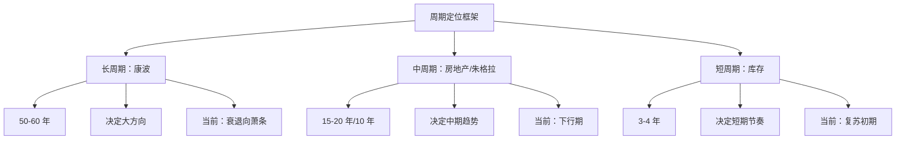
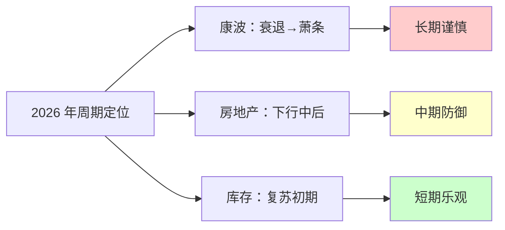
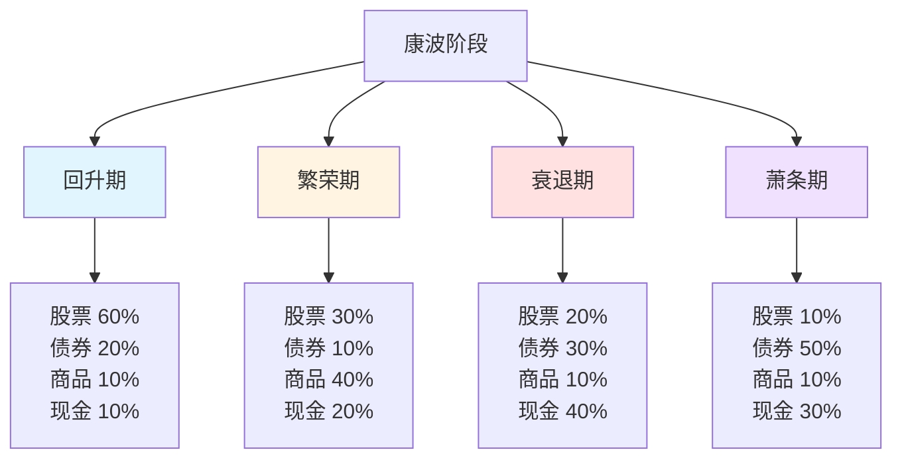
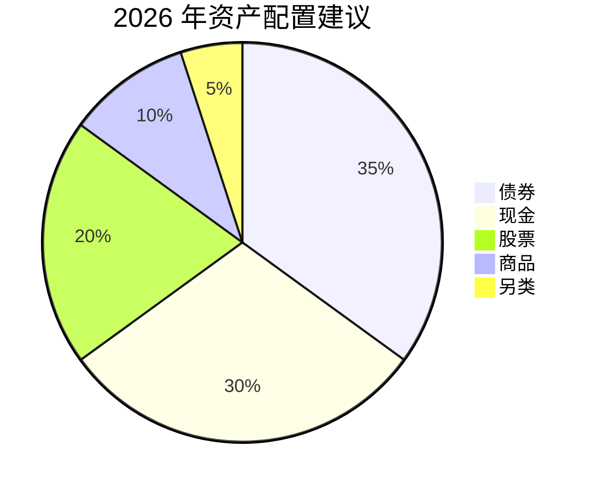
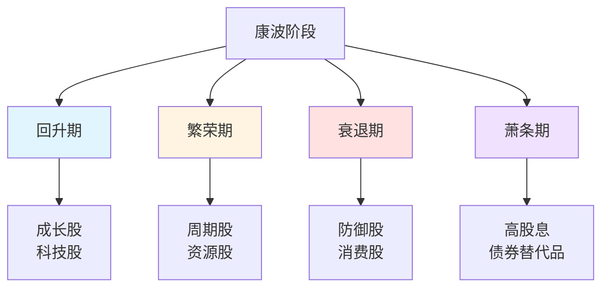
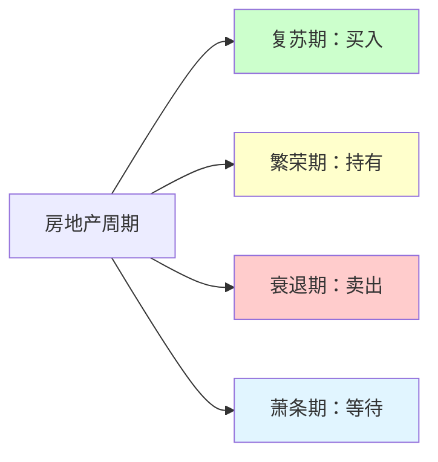
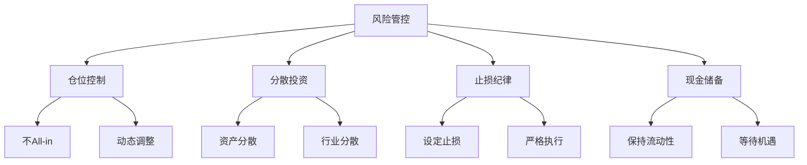
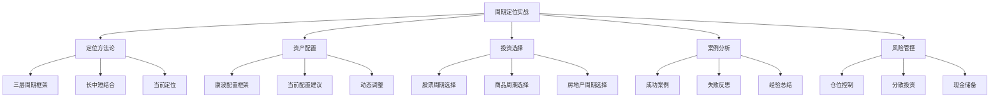

# 周期定位实战 - 学习笔记

> 最后更新：2026-03-11
> 📚 来源：《涛动周期论》《涛动周期录》- 周金涛

---

## 📚 知识点总览

- 周期定位的方法论
- 资产配置的策略框架
- 不同周期的投资选择
- 实战案例分析
- 风险管控原则

---

## 一、周期定位方法论

### 1.1 三层周期定位框架

**核心概念**：
- 周期定位需要**从长到短**层层分析
- 长周期决定方向，短周期决定节奏
- 三层周期共振时，机遇最明确

**框架结构**：

**周金涛的方法**：
> "先定长周期位置，再看中周期趋势，最后把握短周期节奏"
> 
> "三层周期共振时，是最佳的投资或退出时机"
> 
> "长周期向下时，短周期反弹是退出机会"

---

### 1.2 当前周期定位（2026 年视角）

**康德拉季耶夫周期定位**：

| 维度 | 当前状态 | 判断依据 |
|------|----------|----------|
| **时间位置** | 第五次康波衰退末期 | 1990 年起，已 36 年 |
| **经济增长** | 增速放缓 | 全球 GDP 增速下降 |
| **技术创新** | 信息技术成熟 | 互联网普及，AI 兴起 |
| **价格水平** | 通胀波动 | 疫情后通胀上升 |
| **判断** | 衰退向萧条过渡 | 预计 2025-2030 进入萧条 |

**房地产周期定位**：

| 维度 | 当前状态 | 判断依据 |
|------|----------|----------|
| **时间位置** | 下行期 | 2016 年见顶，已 10 年 |
| **价格水平** | 分化调整 | 一二线企稳，三四线下跌 |
| **政策取向** | 房住不炒 | 长效机制建立 |
| **判断** | 下行中后期 | 投资属性减弱 |

**库存周期定位**：

| 维度 | 当前状态 | 判断依据 |
|------|----------|----------|
| **时间位置** | 复苏初期 | 2023 年底部，已 2-3 年 |
| **企业库存** | 被动去库存 | 产成品存货下降 |
| **PPI** | 回升中 | 由负转正 |
| **判断** | 被动去库存向主动补库存过渡 |

**综合判断**：

---

## 二、资产配置策略

### 2.1 康波不同阶段的资产配置

**核心框架**：

**详细配置建议**：

| 康波阶段 | 股票 | 债券 | 商品 | 现金 | 核心策略 |
|----------|------|------|------|------|----------|
| **回升期** | 60% | 20% | 10% | 10% | 积极投资成长股 |
| **繁荣期** | 30% | 10% | 40% | 20% | 持有商品和周期股 |
| **衰退期** | 20% | 30% | 10% | 40% | 现金为王，防守为主 |
| **萧条期** | 10% | 50% | 10% | 30% | 债券为主，等待机会 |

---

### 2.2 当前资产配置建议（2026 年）

**基于周期定位的配置**：

**配置逻辑**：

| 资产类别 | 配置比例 | 配置逻辑 |
|----------|----------|----------|
| **债券** | 35% | 康波萧条期受益，提供稳定收益 |
| **现金** | 30% | 保持流动性，等待机遇 |
| **股票** | 20% | 结构性机会，精选成长股 |
| **商品** | 10% | 对冲通胀，配置黄金 |
| **另类** | 5% | 私募、REITs 等分散风险 |

**周金涛的建议**：
> "2018-2025 年是现金为王的时期"
> 
> "2025 年后可以逐步增加风险资产"
> 
> "债券是康波萧条期最好的资产"

---

## 三、不同周期的投资选择

### 3.1 股票投资的周期选择

**康波周期与股票**：

**行业轮动规律**：

| 周期阶段 | 受益行业 | 逻辑 |
|----------|----------|------|
| **回升期** | 科技、成长 | 新技术应用 |
| **繁荣期** | 资源、周期 | 需求旺盛 |
| **衰退期** | 消费、医药 | 防御属性 |
| **萧条期** | 公用事业、高股息 | 稳定现金流 |

---

### 3.2 商品投资的周期选择

**康波与商品**：

| 商品类别 | 繁荣期 | 衰退期 | 萧条期 | 回升期 |
|----------|--------|--------|--------|--------|
| **能源** | ⭐⭐⭐⭐⭐ | ⭐⭐ | ⭐ | ⭐⭐⭐ |
| **金属** | ⭐⭐⭐⭐⭐ | ⭐⭐ | ⭐ | ⭐⭐⭐ |
| **农产品** | ⭐⭐⭐⭐ | ⭐⭐⭐ | ⭐⭐ | ⭐⭐⭐ |
| **贵金属** | ⭐⭐ | ⭐⭐⭐⭐ | ⭐⭐⭐⭐⭐ | ⭐⭐ |

**周金涛的商品判断**：
> "商品是康波繁荣期最好的资产"
> 
> "2015-2016 年是商品最后的机会"
> 
> "萧条期只有黄金有配置价值"

---

### 3.3 房地产投资的周期选择

**房地产周期定位**：

**周金涛的判断**：
> "2014-2016 年是房地产最后的机会"
> 
> "2018 年后房地产失去普惠性投资价值"
> 
> "未来只有核心城市核心地段有價值"

---

## 四、实战案例分析

### 4.1 周金涛的成功预测

**案例 1：2015-2016 年商品牛市**

| 时间 | 预测 | 实际情况 |
|------|------|----------|
| 2015 年底 | "2016 年商品有机会" | ✅ 2016 年商品大涨 |
| 预测依据 | 库存周期底部 + 供给侧改革 | 黑色系涨幅超 100% |
| 收益空间 | 30-50% | 部分品种超 100% |

**案例 2：2018-2019 年转折点**

| 时间 | 预测 | 实际情况 |
|------|------|----------|
| 2016 年 | "2018-2019 年是万劫不复之年" | ✅ 2018 年股市大跌 |
| 预测依据 | 康波衰退期 + 库存周期下行 | 上证指数跌 25% |
| 建议 | 现金为王 | ✅ 避险成功 |

**案例 3：2019 年机遇**

| 时间 | 预测 | 实际情况 |
|------|------|----------|
| 2018 年底 | "2019 年有第一次机遇" | ✅ 2019 年股市反弹 |
| 预测依据 | 库存周期底部 + 政策转向 | 上证指数涨 22% |
| 建议 | 适度参与 | ✅ 结构性机会 |

---

### 4.2 失败案例反思

**案例：2020 年疫情**

| 项目 | 内容 |
|------|------|
| **预测** | 未预测到疫情冲击 |
| **原因** | 黑天鹅事件无法预测 |
| **教训** | 周期理论有局限，需防范黑天鹅 |
| **改进** | 增加风险对冲，保持充足现金 |

**案例：2021 年核心资产泡沫**

| 项目 | 内容 |
|------|------|
| **预测** | 核心资产持续上涨 |
| **实际情况** | 2021 年核心资产大跌 |
| **原因** | 估值过高 + 流动性收紧 |
| **教训** | 估值是重要的安全边际 |

---

## 五、风险管控原则

### 5.1 周期投资的风险管控

**核心原则**：

**周金涛的建议**：
> "永远不要满仓"
> 
> "现金是应对不确定性的最好工具"
> 
> "活下来比赚多少更重要"

---

### 5.2 个人投资者的实践建议

**行动清单**：

**1. 学习周期理论**
- [ ] 阅读《涛动周期论》《涛动周期录》
- [ ] 理解康波、房地产、库存周期
- [ ] 建立周期分析框架

**2. 确定周期位置**
- [ ] 分析当前康波阶段
- [ ] 判断房地产周期位置
- [ ] 跟踪库存周期指标

**3. 制定配置策略**
- [ ] 根据周期确定资产配置
- [ ] 设定股票、债券、现金比例
- [ ] 定期 rebalance

**4. 执行与调整**
- [ ] 严格执行配置策略
- [ ] 定期检视周期位置
- [ ] 根据周期变化调整

**5. 风险管控**
- [ ] 保持充足现金（20-30%）
- [ ] 不借钱投资
- [ ] 设定止损线

---

## 💡 学习心得

1. **周期定位的复杂性**：周期定位需要综合分析多个维度，不是简单套用公式

2. **理论与实践的结合**：周期理论需要结合实际情况灵活运用，不能生搬硬套

3. **风险管控的重要性**：无论周期判断多准确，风险管控永远是第一位的

4. **长期视角的价值**：周期理论帮助建立长期视角，避免被短期波动干扰

5. **持续学习的必要**：经济环境在变化，周期理论也需要不断更新和完善

---

## ⚠️ 易错点提醒

- ❌ **误区 1**：周期定位可以精确到年月
  - ✅ 正确理解：周期定位是大致范围，不是精确时点

- ❌ **误区 2**：资产配置一成不变
  - ✅ 正确理解：需要根据周期变化动态调整

- ❌ **误区 3**：周期理论可以预测所有波动
  - ✅ 正确理解：周期理论无法预测黑天鹅事件

- ❌ **误区 4**：满仓才能赚大钱
  - ✅ 正确理解：现金储备是应对不确定性的关键

- ❌ **误区 5**：周期定位后就无需关注市场
  - ✅ 正确理解：需要持续跟踪指标，验证判断

---

## 📊 知识图谱

---

## 🔗 相关资源

- **书籍**：
  - 《涛动周期论》- 周金涛
  - 《涛动周期录》- 周金涛
  - 《周期》- 霍华德·马克斯

- **数据**：
  - 国家统计局：GDP、CPI、PPI、库存数据
  - 央行：货币供应、利率数据
  - 各大券商：周期研究报告

- **相关知识点**：
  - [[01-康德拉季耶夫周期理论]]
  - [[02-人生即一次康波]]
  - [[03-房地产周期]]
  - [[04-库存周期]]

---

## ✅ 掌握情况

- [x] 周期定位方法论
- [x] 资产配置策略框架
- [x] 不同周期的投资选择
- [x] 实战案例分析
- [x] 风险管控原则
- [ ] 独立进行周期定位
- [ ] 实战应用能力

---

*本笔记由 AI 助手小小整理生成*
