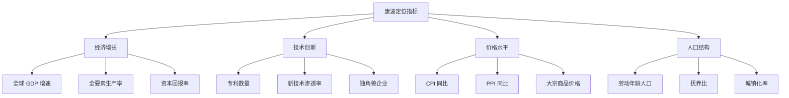
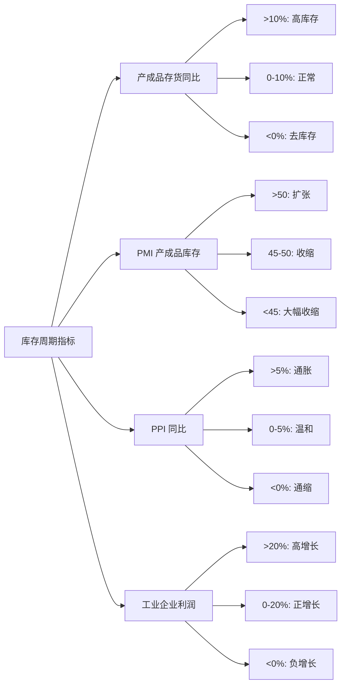
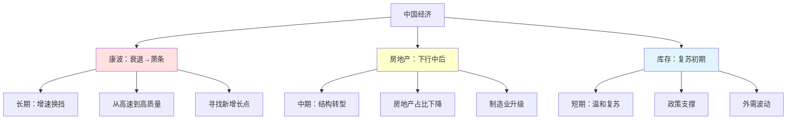
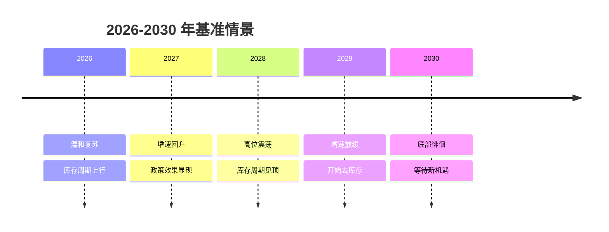
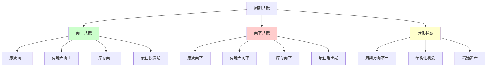
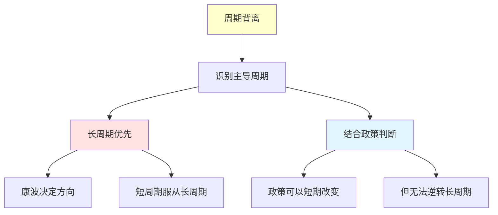
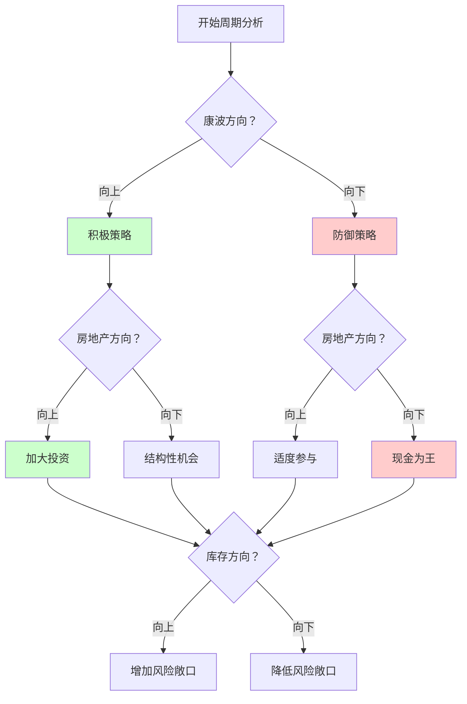
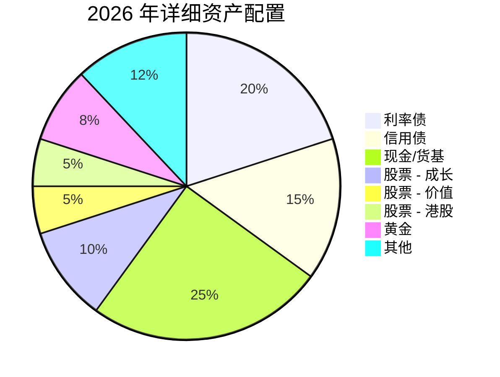
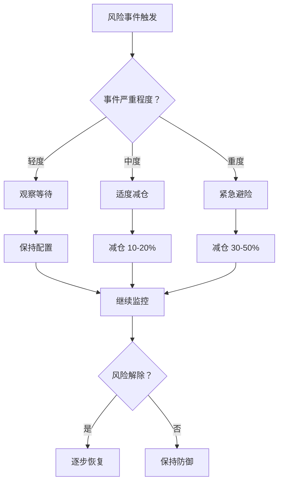
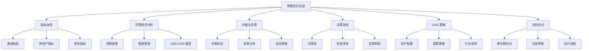

# 周期定位实战 - 深入篇

> 最后更新：2026-03-11
> 📚 来源：《涛动周期论》《涛动周期录》- 周金涛 + 实战延伸

> ⚠️ **本篇为进阶内容**，建议在完成基础篇后阅读

---

## 📚 知识点总览

- 详细周期定位指标体系
- 中国经济周期深度分析
- 周期共振与背离分析
- 实战决策流程与清单
- 2026-2030 年情景推演

---

## 一、周期定位指标体系

### 1.1 康德拉季耶夫周期指标

**核心指标体系**：



**具体指标与阈值**：

| 指标 | 回升期 | 繁荣期 | 衰退期 | 萧条期 | 当前值 (2026) |
|------|--------|--------|--------|--------|---------------|
| **全球 GDP 增速** | 2-3% | 3-4% | 2-3% | <2% | ~2.5% |
| **美国全要素生产率** | 回升 | 高位 | 下滑 | 低位 | 下滑中 |
| **技术创新热度** | 新技术出现 | 全面普及 | 增长放缓 | 等待突破 | AI 兴起 |
| **全球通胀** | 低位稳定 | 持续上升 | 高位波动 | 通缩压力 | 回落中 |
| **大宗商品指数** | 低位回升 | 持续上涨 | 高位震荡 | 持续下跌 | 震荡 |

**康波定位判断卡**：

```
┌─────────────────────────────────────────────────────┐
│  康德拉季耶夫周期定位卡 (2026 年)                    │
├─────────────────────────────────────────────────────┤
│  时间位置：第五次康波 (1990 年起) 第 36 年           │
│  预计长度：50-60 年                                  │
│  当前阶段：衰退末期 → 萧条期过渡                      │
│  关键特征：                                          │
│  ✓ 信息技术成熟普及                                  │
│  ✓ 全球增长放缓                                      │
│  ✓ 通胀从高位回落                                    │
│  ✓ 新技术 (AI) 开始兴起但尚未全面应用                 │
│  预计萧条期：2025-2035 年                            │
│  预计回升期：2035 年后 (新技术革命)                   │
└─────────────────────────────────────────────────────┘
```

---

### 1.2 房地产周期指标

**核心指标体系**：

| 指标类别 | 具体指标 | 复苏期 | 繁荣期 | 衰退期 | 萧条期 |
|----------|----------|--------|--------|--------|--------|
| **价格** | 70 城房价同比 | 转正 | >10% | 转负 | <-5% |
| **成交** | 商品房销售面积 | 回升 | 高位 | 下滑 | 低位 |
| **库存** | 待售面积同比 | 下降 | 低位 | 上升 | 高企 |
| **投资** | 房地产开发投资 | 企稳 | >10% | 下滑 | 负增长 |
| **政策** | 政策取向 | 放松 | 收紧 | 观望 | 刺激 |
| **金融** | 房贷利率 | 下降 | 上升 | 高位 | 下降 |

**中国房地产周期定位卡**：

```
┌─────────────────────────────────────────────────────┐
│  中国房地产周期定位卡 (2026 年)                       │
├─────────────────────────────────────────────────────┤
│  周期起点：2016 年见顶，已进入下行期 10 年            │
│  周期长度：典型 15-20 年，当前处于下行中后期          │
│  价格表现：                                          │
│  ✓ 一二线城市：企稳震荡                              │
│  ✓ 三四线城市：持续调整                              │
│  ✓ 核心地段：相对坚挺                                │
│  政策取向：房住不炒 + 因城施策                        │
│  金融环境：利率下行，支持合理需求                     │
│  判断：下行中后期，逐步筑底                          │
│  预计底部：2026-2028 年                              │
└─────────────────────────────────────────────────────┘
```

---

### 1.3 库存周期指标

**核心指标体系**：



**库存周期四阶段识别**：

| 阶段 | 产成品存货 | PMI 库存 | PPI | 企业利润 | 经济表现 |
|------|------------|----------|-----|----------|----------|
| **被动去库存** | 下降 | 低位 | 低位回升 | 降幅收窄 | 复苏初期 |
| **主动补库存** | 上升 | 上升 | 上涨 | 正增长 | 繁荣期 |
| **被动补库存** | 上升 | 高位 | 高位回落 | 增速放缓 | 放缓期 |
| **主动去库存** | 下降 | 下降 | 下跌 | 负增长 | 衰退期 |

**中国库存周期定位卡**：

```
┌─────────────────────────────────────────────────────┐
│  中国库存周期定位卡 (2026 年)                         │
├─────────────────────────────────────────────────────┤
│  周期起点：2023 年底部，已进入复苏期 2-3 年           │
│  当前阶段：被动去库存 → 主动补库存过渡               │
│  关键指标：                                          │
│  ✓ 产成品存货同比：低位回升                          │
│  ✓ PMI 产成品库存：50 附近震荡                        │
│  ✓ PPI 同比：由负转正                                │
│  ✓ 工业企业利润：降幅收窄                            │
│  判断：复苏初期，温和扩张                            │
│  预计高点：2027-2028 年                              │
└─────────────────────────────────────────────────────┘
```

---

## 二、中国经济周期深度分析

### 2.1 中国经济的周期嵌套

**三层周期嵌套结构**：



**周期共振分析**：

| 时间窗口 | 康波 | 房地产 | 库存 | 共振方向 | 经济表现 |
|----------|------|--------|------|----------|----------|
| 2005-2007 | 繁荣 | 上升 | 上升 | ⬆️ 向上共振 | 经济过热 |
| 2009-2010 | 衰退 | 上升 | 上升 | ⬆️ 向上共振 | 四万亿刺激 |
| 2016-2017 | 衰退 | 见顶 | 上升 | ➡️ 分化 | 供给侧改革 |
| 2018-2019 | 衰退 | 下行 | 下行 | ⬇️ 向下共振 | 经济下行 |
| 2020-2021 | 衰退 | 下行 | 上升 | ➡️ 分化 | 疫情冲击 |
| 2022-2023 | 衰退 | 下行 | 下行 | ⬇️ 向下共振 | 深度调整 |
| 2024-2026 | 衰退→萧条 | 筑底 | 复苏 | ➡️ 弱复苏 | 温和恢复 |
| 2027-2030 | 萧条 | 低位 | 波动 | ⬇️ 偏弱 | 等待新周期 |

---

### 2.2 2026-2030 年情景推演

**基准情景（概率 60%）**：



| 年份 | GDP 增速 | 通胀 | 政策 | 资产表现 |
|------|----------|------|------|----------|
| 2026 | 4.5-5.0% | 温和 | 支持 | 股>债>商品 |
| 2027 | 4.5-5.0% | 回升 | 中性 | 股>商品>债 |
| 2028 | 4.0-4.5% | 高位 | 收紧 | 商品>现金>股 |
| 2029 | 3.5-4.0% | 回落 | 放松 | 债>现金>股 |
| 2030 | 3.5-4.0% | 低位 | 支持 | 债>股>商品 |

**乐观情景（概率 20%）**：

- **触发条件**：AI 技术突破 + 改革深化 + 外需好转
- **经济表现**：增速重回 5%+，全要素生产率提升
- **资产表现**：股票牛市，成长股领涨

**悲观情景（概率 20%）**：

- **触发条件**：地缘冲突 + 债务危机 + 技术封锁
- **经济表现**：增速降至 3% 以下，通缩压力
- **资产表现**：债券牛市，现金为王

---

## 三、周期共振与背离分析

### 3.1 周期共振的识别与利用

**什么是周期共振**：
- 多个周期同时向上或向下
- 共振时经济波动幅度放大
- 共振是最佳的投资或退出时机

**共振识别框架**：



**历史共振案例**：

| 时间 | 康波 | 房地产 | 库存 | 共振方向 | 市场表现 |
|------|------|--------|------|----------|----------|
| 2005-2007 | 繁荣 | 上升 | 上升 | ⬆️ 向上 | 股市 6124 点 |
| 2009-2010 | 衰退 | 上升 | 上升 | ⬆️ 向上 | 四万亿牛市 |
| 2014-2015 | 衰退 | 上升 | 下降 | ➡️ 分化 | 杠杆牛 |
| 2016-2017 | 衰退 | 见顶 | 上升 | ➡️ 分化 | 供给侧行情 |
| 2018-2019 | 衰退 | 下行 | 下行 | ⬇️ 向下 | 股市大跌 |
| 2020-2021 | 衰退 | 下行 | 上升 | ➡️ 分化 | 核心资产牛 |
| 2022-2023 | 衰退 | 下行 | 下行 | ⬇️ 向下 | 深度调整 |

---

### 3.2 周期背离的分析

**什么是周期背离**：
- 不同周期指向相反方向
- 经济表现复杂，难以判断
- 需要结构性分析，不能一概而论

**背离应对策略**：



**2024-2026 年背离分析**：

当前处于**周期背离**状态：
- 康波：衰退→萧条（向下）
- 房地产：下行中后（向下）
- 库存：复苏初期（向上）

**应对策略**：
1. **长周期优先**：康波向下，整体保持谨慎
2. **把握短周期**：库存复苏带来结构性机会
3. **快进快出**：短周期反弹不宜恋战
4. **及时止盈**：达到目标位及时退出

---

## 四、实战决策流程

### 4.1 周期定位决策树



---

### 4.2 投资决策清单

**投资前检查清单**：

```
□ 周期定位分析
  □ 康波阶段判断完成
  □ 房地产周期位置确认
  □ 库存周期阶段识别
  □ 共振/背离状态分析

□ 资产配置检查
  □ 股票比例符合周期阶段
  □ 债券比例符合周期阶段
  □ 现金储备充足 (20-30%)
  □ 商品配置合理

□ 风险控制检查
  □ 未使用杠杆
  □ 资产分散度足够
  □ 止损位设定
  □ 应急预案准备

□ 心理准备检查
  □ 接受周期波动
  □ 不追求完美时点
  □ 长期视角
  □ 独立思考
```

**定期检视清单（季度）**：

```
□ 更新周期定位
  □ 关键指标数据更新
  □ 周期阶段重新判断
  □ 调整资产配置

□ 组合回顾
  □ 收益率分析
  □ 风险指标检查
  □ 偏离度调整

□ 学习提升
  □ 阅读周期研究报告
  □ 反思决策得失
  □ 完善分析框架
```

---

## 五、2026 年实战策略

### 5.1 资产配置建议

**详细配置方案**：



**各类资产详细策略**：

| 资产类别 | 配置比例 | 具体策略 | 预期收益 | 风险等级 |
|----------|----------|----------|----------|----------|
| **利率债** | 20% | 10 年国债、国开债 | 3-4% | 低 |
| **信用债** | 15% | 高等级信用债 | 4-5% | 中低 |
| **现金/货基** | 25% | 货币基金、逆回购 | 2-3% | 低 |
| **股票 - 成长** | 10% | AI、新能源、创新药 | 10-20% | 高 |
| **股票 - 价值** | 5% | 高股息、公用事业 | 5-8% | 中 |
| **股票 - 港股** | 5% | 港股通优质标的 | 10-15% | 高 |
| **黄金** | 8% | 黄金 ETF、实物黄金 | 5-10% | 中 |
| **其他** | 12% | REITs、私募等 | 5-8% | 中 |

---

### 5.2 股票投资策略

**行业配置建议**：

| 行业 | 配置评级 | 逻辑 | 风险 |
|------|----------|------|------|
| **AI/算力** | ⭐⭐⭐⭐ | 新技术革命 | 估值高 |
| **新能源** | ⭐⭐⭐ | 长期趋势 | 产能过剩 |
| **创新药** | ⭐⭐⭐⭐ | 刚需 + 创新 | 政策风险 |
| **消费** | ⭐⭐⭐ | 复苏逻辑 | 恢复缓慢 |
| **高股息** | ⭐⭐⭐⭐ | 防御 + 收益 | 增长有限 |
| **地产链** | ⭐⭐ | 政策博弈 | 趋势向下 |
| **金融** | ⭐⭐⭐ | 低估值 | 坏账风险 |

**股票投资原则**：
1. **仓位控制**：总仓位不超过 30%
2. **分散投资**：单一行业不超过 10%
3. **止盈止损**：盈利 20% 止盈，亏损 10% 止损
4. **长期视角**：选择优质公司，不频繁交易

---

### 5.3 风险应对预案

**黑天鹅应对**：

| 风险类型 | 触发条件 | 应对措施 |
|----------|----------|----------|
| **地缘冲突** | 战争/制裁升级 | 增持黄金、现金，减持股票 |
| **债务危机** | 大型机构违约 | 增持利率债，减持信用债 |
| **疫情反复** | 新变种爆发 | 增持医药，减持消费 |
| **政策转向** | 大幅收紧 | 降低仓位，增持现金 |
| **外部冲击** | 美股大跌 | 降低风险敞口 |

**应急预案执行流程**：



---

## 💡 深度思考

1. **周期的本质是什么**：
   - 周期是人性贪婪与恐惧的循环
   - 周期是供需关系的周期性失衡与再平衡
   - 周期是技术创新的扩散过程

2. **为什么周期难以把握**：
   - 周期长度不固定，难以精确预测
   - 多重周期嵌套，相互影响复杂
   - 黑天鹅事件频繁，打乱周期节奏
   - 人性弱点：贪婪时过度乐观，恐惧时过度悲观

3. **如何提高周期把握能力**：
   - 持续学习，完善知识体系
   - 建立框架，形成分析方法
   - 跟踪数据，验证判断
   - 反思总结，不断改进
   - 保持谦逊，承认认知局限

---

## ⚠️ 重要提醒

- ❗ **周期理论是框架，不是预测神器**
  - 帮助理解经济运行规律
  - 无法精确预测具体时点
  - 需要结合其他分析方法

- ❗ **历史不会简单重复**
  - 每次周期都有特殊性
  - 不能简单套用历史经验
  - 需要与时俱进

- ❗ **风险管理永远是第一位的**
  - 活下来比赚多少更重要
  - 不要 All-in，保持现金储备
  - 做好最坏打算

---

## 📊 知识图谱（完整版）



---

## 🔗 延伸阅读

- **进阶书籍**：
  - 《周期》- 霍华德·马克斯
  - 《债务危机》- 瑞·达利欧
  - 《原则》- 瑞·达利欧
  - 《逃不开的经济周期》- 拉斯·特维德

- **研究报告**：
  - 中信证券周期研究系列
  - 中金公司宏观研究
  - 各大券商策略报告

- **数据工具**：
  - 国家统计局数据库
  - Wind 金融终端
  - 同花顺 iFinD

---

## ✅ 掌握情况（进阶）

- [x] 周期定位指标体系
- [x] 中国经济周期分析
- [x] 周期共振与背离
- [x] 决策流程与清单
- [x] 2026 年实战策略
- [ ] 独立进行完整分析
- [ ] 实战验证与优化

---

*本笔记由 AI 助手小小整理生成 - 周期定位实战深入篇*
