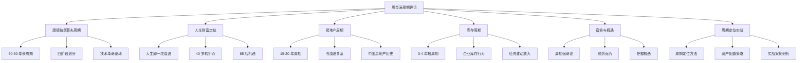

# 周期理论 - 学习计划

> 📅 创建日期：2026-03-11
> 🎯 预计完成：TBD
> 📚 核心著作：《涛动周期论》《涛动周期录》- 周金涛

---

## 📚 知识体系

---

## 📋 学习知识点清单

### 1. 康德拉季耶夫周期理论
- [x] 康波的定义与特征
- [x] 康波的四个阶段
- [x] 历次康波划分
- [x] 第五次康波定位
- [x] 康波与技术创新

### 2. 人生财富定位
- [x] 人生与康波的时间对应
- [x] 财富积累的周期规律
- [x] 40 岁关键转折点
- [x] 85 后的人生机遇
- [x] 个人周期定位方法

### 3. 房地产周期
- [x] 房地产周期基本原理
- [x] 房地产与康波的关系
- [x] 中国房地产周期历史
- [x] 房地产投资机遇
- [x] 未来趋势判断

### 4. 库存周期（基钦周期）
- [x] 库存周期的定义
- [x] 库存周期的形成机制
- [x] 库存周期与经济波动
- [x] 中国库存周期分析
- [x] 库存周期投资策略

### 5. 宿命与机遇
- [x] 周期宿命论的哲学基础
- [x] 个人与周期的关系
- [x] 如何识别周期机遇
- [x] 如何把握周期机遇
- [x] 案例分析

### 6. 周期定位与实战
- [x] 周期定位方法
- [x] 资产配置策略
- [x] 不同周期的投资选择
- [x] 实战案例分析
- [x] 风险管控

---

## 📊 进度跟踪

| 日期 | 学习内容 | 完成知识点 | 备注 |
|------|----------|------------|------|
| 2026-03-11 | 康波理论、人生定位、房地产 | 3 个知识点 | 创建 3 篇笔记 |
| 2026-03-11 | 库存周期、宿命与机遇、周期定位实战 | 3 个知识点 | 完成全部笔记 |
| 2026-03-11 | **主题完成** | **6/6 知识点** | **🎉 100% 完成** |

---

## 🎯 里程碑

- [x] 17% - 完成康德拉季耶夫周期理论
- [x] 33% - 完成人生财富定位
- [x] 50% - 完成房地产周期
- [x] 67% - 完成库存周期
- [x] 83% - 完成宿命与机遇
- [x] 100% - 完成周期定位实战 🎉

---

## 📝 笔记完成清单

| 编号 | 笔记标题 | 完成日期 | 字数 |
|------|----------|----------|------|
| 01 | 康德拉季耶夫周期理论 | 2026-03-11 | ~4000 |
| 02 | 人生即一次康波 | 2026-03-11 | ~4000 |
| 03 | 房地产周期 | 2026-03-11 | ~5000 |
| 04 | 库存周期 | 2026-03-11 | ~5800 |
| 05 | 宿命与机遇 | 2026-03-11 | ~6000 |
| 06 | 周期定位实战 | 2026-03-11 | ~7000 |
| **合计** | **6 篇笔记** | **2026-03-11** | **~32000 字** |

---

*本计划由 AI 助手小小生成*
