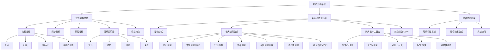

# 投资分析系统 - 学习主题

> 📅 创建日期：2026-03-12
> 🎯 预计完成：2026-06-02
> 📚 核心内容：宏观周期定位 + 新股动态溢价率

---

## 📚 知识体系

---

## 📋 学习知识点清单

### 1. 宏观周期定位指标
- [x] 先行、同步、滞后指标分类
- [x] 周期四阶段特征（复苏/过热/滞胀/衰退）
- [x] 美林时钟与中国版周期定位
- [x] 历史分位数计算方法
- [x] 领先滞后关系量化（互相关、格兰杰因果）
- [x] PCA 综合周期指数构建
- [x] 行业轮动模型

### 2. 新股动态溢价率基础
- [x] 动态溢价率概念与基础公式
- [x] 影响溢价率的核心因素
- [x] 典型走势模式（高开高走/高开低走等）
- [x] 学术文献与研究报告综述

### 3. 七大进阶公式
- [x] 时间衰减调整溢价率
- [x] 市场调整溢价率 (MAP)
- [x] 行业相对溢价率
- [x] 情绪调整溢价率
- [x] 风险调整溢价率 (RAP)
- [x] 流动性调整溢价率
- [x] 综合动态溢价率指数 (CDPI)

### 4. 八大相对估值方法
- [x] PE 相对溢价率
- [x] PEG 调整溢价率
- [x] PB/ROE 调整溢价率
- [x] PS/营收增速调整
- [x] 可比公司法
- [x] DCF 隐含溢价率
- [x] 流动性调整
- [x] 稀缺性溢价

### 5. 综合决策框架
- [x] 周期定位指导新股策略
- [x] 周期调整权重（复苏 1.2/过热 0.8/滞胀 0.6/衰退 1.0）
- [x] 综合决策公式
- [x] 实战案例应用

---

## 📊 进度跟踪

| 日期 | 学习内容 | 完成知识点 | 备注 |
|------|----------|------------|------|
| 2026-03-12 | 周期定位指标体系 | 7 个知识点 | 创建基础笔记 |
| 2026-03-12 | 新股动态溢价率基础 | 4 个知识点 | 创建基础笔记 |
| 2026-03-12 | 七大进阶公式 | 7 个知识点 | 创建进阶笔记 |
| 2026-03-12 | 八大相对估值法 | 8 个知识点 | 创建估值笔记 |
| 2026-03-12 | 综合决策框架 | 4 个知识点 | 整合学习主题 |
| TBD | 阶段一：数据基础 | - | AKShare 数据管道 |
| TBD | 阶段二：指标计算 | - | 实现核心公式 |
| TBD | 阶段三：模型构建 | - | PCA+XGBoost 模型 |
| TBD | 阶段四：回测验证 | - | 策略回测 |
| TBD | 阶段五：可视化部署 | - | 仪表板 + 监控 |

---

## 🎯 里程碑

- [x] 20% - 完成宏观周期定位指标 ✅
- [x] 40% - 完成新股动态溢价率基础 ✅
- [x] 60% - 完成七大进阶公式 ✅
- [x] 80% - 完成八大相对估值法 ✅
- [x] 100% - 完成综合决策框架 ✅
- [ ] 阶段一：数据基础（2026-03-13 ~ 03-24）
- [ ] 阶段二：指标计算（2026-03-25 ~ 04-07）
- [ ] 阶段三：模型构建（2026-04-08 ~ 04-28）
- [ ] 阶段四：回测验证（2026-04-29 ~ 05-19）
- [ ] 阶段五：可视化部署（2026-05-20 ~ 06-02）

---

## 📝 笔记完成清单

### 基础篇（2 篇）

| 编号 | 笔记标题 | 完成日期 | 字数 |
|------|----------|----------|------|
| 01 | 周期定位指标体系 | 2026-03-12 | ~8000 |
| 02 | 新股动态溢价率基础 | 2026-03-12 | ~8000 |
| **小计** | **基础篇 2 篇** | **2026-03-12** | **~16000 字** |

### 进阶篇（3 篇）

| 编号 | 笔记标题 | 完成日期 | 字数 |
|------|----------|----------|------|
| 03 | 新股溢价率研究报告 | 2026-03-12 | ~5500 |
| 04 | 实时动态溢价率进阶公式 | 2026-03-12 | ~13000 |
| 05 | 新股相对老股溢价率 | 2026-03-12 | ~17000 |
| **小计** | **进阶篇 3 篇** | **2026-03-12** | **~35500 字** |

### 实战篇（5 篇）

| 编号 | 笔记标题 | 完成日期 | 字数 |
|------|----------|----------|------|
| 06 | 动态溢价率实战案例 | 2026-03-12 | ~8000 |
| 07 | 动态溢价率 Python 实战代码 | 2026-03-12 | ~23000 |
| 08 | 新股分类与交易策略 | 2026-03-12 | ~5500 |
| 09 | 2024 年新股分类实战 | 2026-03-12 | ~7000 |
| 10 | 2025 年新股分类实战 | 2026-03-12 | ~10500 |
| **小计** | **实战篇 5 篇** | **2026-03-12** | **~54000 字** |

### 整合篇（1 篇）

| 编号 | 笔记标题 | 完成日期 | 字数 |
|------|----------|----------|------|
| 08 | 学习主题总览 | 2026-03-12 | ~8000 |
| **小计** | **整合篇 1 篇** | **2026-03-12** | **~8000 字** |

### 总计

| 类别 | 笔记数量 | 总字数 | 状态 |
|------|----------|--------|------|
| **全部** | **11 篇** | **~105500 字** | **✅ 理论 + 实战完成** |

---

## 📁 笔记文件映射

| 学习主题文件 | 来源文件 |
|--------------|----------|
| `学习笔记/01-周期定位指标体系.md` | `memory/2026-03-12.md` |
| `学习笔记/02-新股动态溢价率基础.md` | `memory/2026-03-12-新股动态溢价率.md` |
| `学习笔记/03-新股溢价率研究报告.md` | `memory/2026-03-12-新股溢价率研究报告.md` |
| `学习笔记/04-实时动态溢价率进阶公式.md` | `memory/2026-03-12-实时动态溢价率进阶公式.md` |
| `学习笔记/05-新股相对老股溢价率.md` | `memory/2026-03-12-新股相对老股溢价率.md` |
| `学习笔记/06-动态溢价率实战案例.md` | 原创 |
| `学习笔记/07-动态溢价率 Python 实战代码.md` | 原创 |
| `学习笔记/08-新股分类与交易策略.md` | 小徒经验整理 |
| `学习笔记/09-2024 年新股分类实战.md` | 2024 年新股实战分类 |
| `学习笔记/10-2025 年新股分类实战.md` | 2025 年新股实战分类 |
| `学习计划/主题学习计划.md` | 本文件 |

---

## 🛠️ 工具与数据源

### Python 库
- 数据获取：`akshare`, `tushare`
- 时间序列分析：`statsmodels`, `sklearn`
- 机器学习：`xgboost`, `randomforest`
- 可视化：`matplotlib`, `seaborn`, `plotly`

### 数据源
- 宏观数据：国家统计局、央行、AKShare
- IPO 数据：巨潮资讯、上交所、深交所
- 行情数据：AKShare、Tushare、Wind
- 研报：慧博投研、萝卜投研

---

## 🔗 相关资源

- 官方文档：[AKShare](https://akshare.akfamily.xyz)
- 参考教程：[周金涛《涛动周期论》](https://book.douban.com/subject/27137917/)
- 相关知识点：[[02-周期理论]]

---

*本计划由 AI 助手整理生成*
